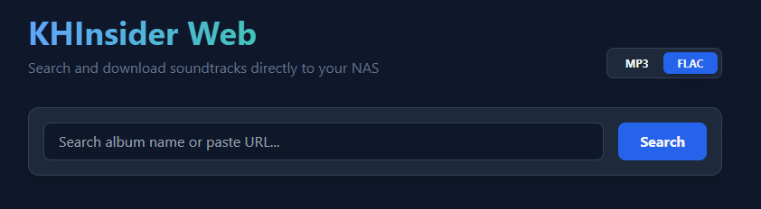

# KHInsider Web Downloader

A lightweight, self-hosted web application to search and batch-download video game soundtracks from KHInsider directly to local storage or NAS. This tool provides a modern interface for managing music archives with support for lossless formats.



### Core Functionality

* **Search Engine**: Integrated search to find albums by title without leaving the application.
* **Format Selection**: Toggle between FLAC (Lossless) and MP3 (Standard) downloads.
* **Filename Sanitization**: Automatically decodes URL characters and strips website footers for clean directory structures.
* **Real-time Monitoring**: Terminal-style log viewer with live progress bars and track indexing.
* **NAS Optimization**: Designed for TrueNAS, Unraid, and Docker-based media servers.

---

## Installation and Deployment

### 1. Prerequisites

* Docker and Docker Compose installed on the host server.
* A dedicated dataset or directory on the NAS for the music library.

### 2. Project Structure

Maintain the following directory hierarchy for a successful build:

```text
khinsider-downloader/
├── app.py              # Flask Backend Logic
├── requirements.txt    # Python Dependencies
├── Dockerfile          # Image Configuration
├── docker-compose.yml  # Deployment Configuration
└── templates/          # Frontend Assets
    └── index.html      # User Interface

```

### 3. Build and Launch

Navigate to the project root and execute the following command:

```bash
docker-compose up -d --build

```

The interface will be accessible via a web browser at `http://[YOUR-NAS-IP]:5005`.

---

## Configuration for TrueNAS and Docker

### Volume Mapping

Update the `volumes` section in `docker-compose.yml` to reflect your actual music dataset path on the host.

```yaml
volumes:
  - /mnt/tank/Media/Music:/downloads

```

### Permission Management

If the application reports a permission error when attempting to write files, verify the UID/GID of the dataset owner. TrueNAS SCALE often utilizes UID `568` for applications. Match the container user to the dataset owner in the `docker-compose.yml`:

```yaml
services:
  kh-downloader:
    # ...
    user: "1000:1000"  # Replace with your specific UID:GID

```

---

## Usage Instructions

1. **Search**: Input a game title or specific album name in the search bar.
2. **Verification**: Click the Check Website link provided with each result to verify the album content on the source website.
3. **Format Configuration**: Use the toggle switch in the interface header to select the preferred file extension.
4. **Download**: Initiate the process via the download button. The application will analyze the tracklist and begin sequential downloads.
5. **Output**: Files are saved into subfolders named by the album title, with spaces replaced by underscores for cross-platform compatibility.

---

## Technical Specifications

### Dependencies

The following Python libraries are utilized and included in the requirements file:

* **flask**: Web framework and SSE streaming.
* **requests**: HTTP communication with the source server.
* **beautifulsoup4**: HTML parsing and metadata extraction.

### Sanitization Logic

The application implements specific regex patterns to strip marketing suffixes such as "MP3 Soundtracks for FREE" from the directory names, ensuring a clean library structure.
